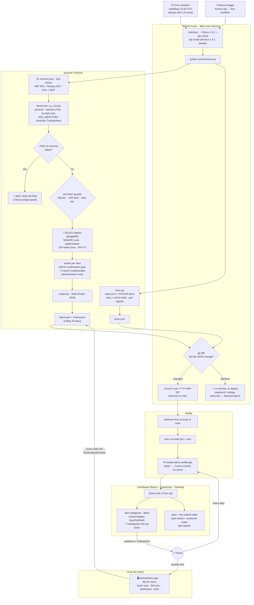

# Market Alerts Dashboard

Daily alerts for financial opportunities in US stocks (S&P 500 + Nasdaq 100), German DAX and BIST Istanbul (~624 tickers total) plus a forex overview, on a static dashboard. **$0/month**: GitHub stores the code and the scan results; Netlify hosts the dashboard.

**Live:** https://market-alerts.netlify.app

## Stock alerts

| Category | Rules | Meaning |
|---|---|---|
| Price × SMA 200 | `PRICE_SMA200_BULL` / `_BEAR` | Daily close crossed above/below its 200-day SMA |
| Golden / Death cross | `GOLDEN_CROSS` / `DEATH_CROSS` | SMA 50 crossed above/below SMA 200 |
| 200-week SMA (secular) | `PRICE_SMA200W_BULL` / `_BEAR` | Weekly close crossed the 200-**week** SMA — rare (~once per 18 months per stock), evaluated on completed weeks only |
| RSI extended | `RSI_OVERBOUGHT` | RSI(14) crossed above 75 in an uptrend — trim/take-profit alert (the only exit refinement that survived backtesting, see `docs/EXITS.md`) |

### Buy / Hold / Sell verdict

Every stock alert carries a verdict built from three layers:

1. **Signal direction** — bullish → buy-lean, bearish → sell-lean.
2. **MACD gate** (false-signal filter): if daily MACD momentum disagrees with the
   signal, the verdict is capped at **HOLD** ("possible false break").
3. **Fundamentals veto** — 5-factor score from yfinance (analyst consensus,
   forward P/E, FCF yield, target upside, earnings growth; −5…+5). Bullish
   signal + weak fundamentals → HOLD; bearish signal + strong fundamentals →
   HOLD ("trim rather than exit").

Fundamentals are fetched only for tickers that alerted that day; any fetch
failure degrades gracefully to a technicals-only verdict. Hover a verdict badge
for the reasoning. Logic lives in [`scanner/recommend.py`](scanner/recommend.py).

### Price structure (Fibonacci + volume)

Each alert also carries **display-only** context (no verdict effect yet):

- **Fibonacci retracements**, daily and weekly. Deterministic recent-swing
  anchor: swing high/low = highest high / lowest low over the last **252
  trading days** (~1 year, daily) or **104 completed weeks** (~2 years, weekly). Levels = 23.6 /
  38.2 / 50 / 61.8 / 78.6% between swing low and high; each carries a signed
  distance % (+ price above the level → support below; − below → resistance
  above). Alert rows show the nearest daily level; Buy cards show the full
  daily + weekly ladders. *Caveat:* unlike an SMA, Fib depends on the swing
  chosen — the fixed windows make it reproducible but are one specific choice.
- **Volume vs 20-day average** — `ratio = today / SMA(volume, 20)`; a breakout
  on above-average volume is more trustworthy than one on thin volume.

Both compute from OHLCV already in memory (all markets), in
[`scanner/levels.py`](scanner/levels.py) and
[`scanner/indicators.py`](scanner/indicators.py). Not yet backtested into the
verdict — that's the next honest step before wiring them in.

## Portfolio page

A personal trade backlog. Add positions from a Buy card ("+ portfolio" with
shares / avg cost / date, prefilled from the alert) or manually on the
Portfolio tab. Open positions are valued against `prices.json` (latest close
for every scanned ticker, written by the daily scan) with unrealized P&L;
selling a position logs it as a closed trade with realized P&L and holding
period. **Storage: this browser's localStorage only** — holdings never leave
your machine; use Export/Import backup to move browsers or protect against
cleared browser data.

## Sectors page

Sector rotation for US equities via the 11 SPDR Select Sector ETFs, read
against SPY. The signal is **relative strength** (sector return − SPY return):
money rotates toward sectors beating the market. Each sector shows multi-horizon
returns (1w–1y, colored heatmap), RS at 1m/3m, trend regime (vs 200-day SMA),
and an RRG-style **state** — leading / improving / weakening / lagging — from the
sign of short vs medium RS. Ranked leaders→laggards by a recency-weighted RS
blend (50% 1m · 35% 3m · 15% 6m). Data: [`scanner/sectors.py`](scanner/sectors.py),
rides the daily scan like forex.

## Forex page

- **Currencies** (EUR, GBP, JPY, CHF, CAD, AUD, NZD, TRY vs USD benchmark):
  policy rate, last change, carry vs USD, trend of the XXXUSD pair vs its
  200-day SMA, a rule-based suggestion (carry × trend), and a discretionary
  **6-month rate forecast + long/short call** (Claude's opinion, dated on the
  page — hover the call for reasoning).
- **Major pairs** (11 pairs incl. EURUSD, USDJPY, USDTRY, crosses): price,
  trend, 1-month change, **rate balance** (base minus quote rate) and a
  **combined read** — green when carry and trend align bullishly, red when
  bearishly, amber when they conflict.
- **Pair signals**: every pair runs through the same alert rules as stocks.

**Maintaining rates:** policy rates have no reliable free API, so they live in
[`scanner/rates.json`](scanner/rates.json) and are updated **manually** after
central-bank meetings (bump `as_of`; it is displayed on the page so staleness
is always visible). FX prices update automatically with the daily scan.

## How it works

No backend, no database. On weekends/holidays the scan produces identical JSON → no commit → no deploy.



## Run locally

Double-click **MarketAlerts.app**, or:

```
./dev.sh
```

Menu: `1)` quick scan (10 tickers) + dashboard · `2)` full scan (~5 min) · `3)` dashboard only · `4)` tests (41).

## Research library (docs/)

Every strategy question was backtested before shipping; the studies are
reproducible with one command each (validated on the last 5 years AND
out-of-sample on 2016–2021 where noted):

| Doc | Question | Headline finding |
|---|---|---|
| `BACKTEST.md` | Do the alerts predict returns? (27k signals) | Attention signals, not profit machines — none beat buy-and-hold's baseline |
| `STRATEGY.md` / `STRATEGY-RSI65.md` | SMA200 in/out trading rule; RSI entry filter | ~Half of buy-and-hold's return for modestly smaller drawdowns; RSI entry filter is a wash |
| `SWEEP.md` | 36-combo parameter grid + OOS validation | In-sample winners flipped out-of-sample — parameter tuning is regime-fitting |
| `PULLBACK.md` / `HYBRID.md` | Buy-the-dip entries (SMA30 cross) | Consistent but lowest returns; fast exits cut winners early |
| `WEEKLY.md` | 40-week & 200-week SMA on weekly bars | Whipsaw halves but returns don't improve; 200-week crosses = rare, high-quality events → became an alert |
| `EXITS.md` | 6 exit rules incl. MACD, RSI, SMA50/90 | Exits into weakness always lose; **RSI>75 take-profit was the only exit beating baseline in both windows** → became an alert |
| `PROFILE.md` | Which stocks does the model work on? | Detectable in hindsight (crashed/choppy names), not in advance — no tradeable screen |

Tools: `scanner/backtest.py` (event study), `scanner/strategy_backtest.py`
(trading simulation; `--model trend|pullback|hybrid`, `--interval 1d|1wk`,
`--sma/--confirm/--band/--rsi-max`, `--validate` for two-window comparison),
`scanner/sweep.py` (parameter grid), `scanner/profile.py` (trait analysis).

## Validating against TradingView

Every alert ticker links to its TradingView chart. To validate:
1. Open the ticker's daily chart, add indicator **SMA 200** (and **SMA 50** for golden/death), source = **close**.
2. Confirm yesterday's close was on the other side of the SMA and today's close on this side.
3. The SMA value should match `values.sma200` within a cent or two.

SMAs are computed on Yahoo's **raw Close** (`auto_adjust=False`): split-adjusted but *not* dividend-adjusted — the same data TradingView uses on daily charts, so values match. Tradeoff: high-dividend names can show an occasional spurious cross around ex-dividend dates; we accept this to stay TradingView-comparable.

## Known behaviors

- **BIST tickers** carry Yahoo's `.IS` suffix and German tickers `.DE`; bar dates are tracked per market (different holidays/close times), and TradingView links map to `BIST:SYMBOL` / `XETR:SYMBOL`. Each alert row shows a market badge (US/DE/BIST) and the market filter separates them. Fundamentals coverage on Yahoo is good for BIST large caps, thinner for small caps — verdicts degrade to technicals-only where data is missing.
- **GOOG/GOOGL** (and other dual-class shares) are both in the universe and will fire near-duplicate alerts on the same day. Expected.
- Tickers with **< 201 daily bars** (recent IPOs) are skipped and listed under `insufficient_history` in the scan status.
- **Persistent failures** usually mean a delisted/renamed ticker — prune `scanner/universe.json` quarterly.
- **Weekly (200-week) alerts** are dated to the completed week's Friday and stay in `latest.json` until the next week completes — by design, so a secular cross stays visible for a week.
- Yahoo's fundamentals endpoint (`.info`) is slow/flaky — verdicts fall back to technicals-only when it fails (tooltip says "fundamentals unavailable").
- GitHub disables scheduled workflows after **60 days of repo inactivity**. Daily data commits keep it alive, but if alerts ever stop, check the repo's **Actions tab** first.
- The cron is fixed at 22:30 UTC → 5:30 pm ET in summer, 6:30 pm ET in winter. Always after the close.

## Adding a new alert type

1. Create `scanner/alerts/<your_rule>.py` with a class implementing `AlertRule` (see `alerts/base.py`).
2. Append an instance to `RULES` in `scanner/alerts/__init__.py`.
3. Add a golden-case test in `scanner/tests/test_alerts.py`.

`scan.py`, the verdict layer, the forex pair scan, and the dashboard all pick it
up automatically (new categories render as their own section).

---

*Nothing here is investment advice. The backtests say it plainly: these are
attention signals for human review, not autopilot orders.*
