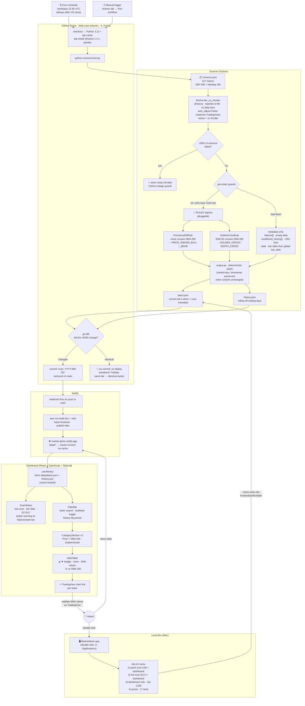

# Market Alerts Dashboard

Daily alerts for financial opportunities in US stocks (S&P 500 + Nasdaq 100, ~517 tickers), shown on a static dashboard. **$0/month**: GitHub stores the code and the scan results; Netlify hosts the dashboard.

## Phase 1 alerts

| Category | Rules | Meaning |
|---|---|---|
| Price × SMA 200 | `PRICE_SMA200_BULL` / `PRICE_SMA200_BEAR` | Daily close crossed above/below its 200-day SMA |
| Golden / Death cross | `GOLDEN_CROSS` / `DEATH_CROSS` | SMA 50 crossed above/below SMA 200 |

## How it works

No backend, no database. On weekends/holidays the scan produces identical JSON → no commit → no deploy.



## Run locally

Double-click **MarketAlerts.app**, or:

```
./dev.sh
```

Menu: `1)` quick scan (10 tickers) + dashboard · `2)` full scan (~5 min) · `3)` dashboard only · `4)` tests.

## Validating against TradingView

Every alert ticker in the dashboard links to its TradingView chart. To validate:
1. Open the ticker's daily chart, add indicator **SMA 200** (and **SMA 50** for golden/death), source = **close**.
2. Confirm yesterday's close was on the other side of the SMA and today's close on this side.
3. The SMA value should match `values.sma200` within a cent or two.

SMAs are computed on Yahoo's **raw Close** (`auto_adjust=False`): split-adjusted but *not* dividend-adjusted — the same data TradingView uses on daily charts, so values match. Tradeoff: high-dividend names can show an occasional spurious cross around ex-dividend dates; we accept this to stay TradingView-comparable.

## Forex page

The **Forex** tab shows major currencies (EUR, GBP, JPY, CHF, CAD, AUD, NZD, TRY)
with: central-bank policy rate, last change, carry vs USD, the currency's trend
against the dollar (XXXUSD pair vs its 200-day SMA, refreshed by the daily scan),
and a transparent rule-based suggestion (carry × trend). Informational only.

**Maintaining rates:** policy rates have no reliable free API, so they live in
[`scanner/rates.json`](scanner/rates.json) and are updated **manually** after
central-bank meetings (bump `as_of` too — it is displayed on the page so
staleness is always visible). FX prices update automatically.

## Known behaviors

- **GOOG/GOOGL** (and other dual-class shares) are both in the universe and will fire near-duplicate alerts on the same day. Expected.
- Tickers with **< 201 daily bars** (recent IPOs) are skipped and listed under `insufficient_history` in the scan status.
- **Persistent failures** usually mean a delisted/renamed ticker — prune `scanner/universe.json` quarterly.
- GitHub disables scheduled workflows after **60 days of repo inactivity**. Daily data commits keep it alive, but if alerts ever stop, check the repo's **Actions tab** first.
- The cron is fixed at 22:30 UTC → 5:30 pm ET in summer, 6:30 pm ET in winter. Always after the close.

## Adding a new alert type (Phase 2+)

1. Create `scanner/alerts/<your_rule>.py` with a class implementing `AlertRule` (see `alerts/base.py`).
2. Append an instance to `RULES` in `scanner/alerts/__init__.py`.
3. Add a golden-case test in `scanner/tests/test_alerts.py`.

`scan.py` and the dashboard pick it up automatically (new categories render as their own section).
